## Исходный код

Была реализована программа crackme на языке C, выполняющая следующие действия:
1. Считывание пароля из файла `password.txt`.  
2. В случае совпадения его с введённым с консоли:  
   1. Запись серийного номера в файл `serial.txt`.  
   2. Выполнение «полезного функционала» — слияние строк из файла `merge_strings.txt` без повторяющихся символов.  
   3. Вывод получившихся строк в консоль.
	
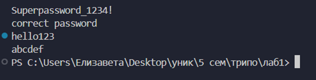<br>

3.    В случае неверного пароля ничего не выполняется

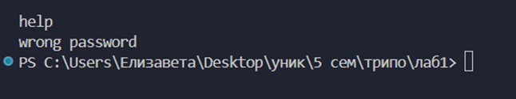<br>

Проверка пароля осуществляется в main с помощью функции check_password:

```
if (check_password(string)) {
        printf("correct password\n");
        create_key(string);
        merge_strings(string);
    }
    else printf("wrong password\n");
```


## Модификация исполняемого файла

Участок кода, отвечающий за проверку пароля (рисунок 3), был найден благодаря названиям функций (change_password, create_key, check_password) и выводимым строкам (“correct password”, “wrong password):

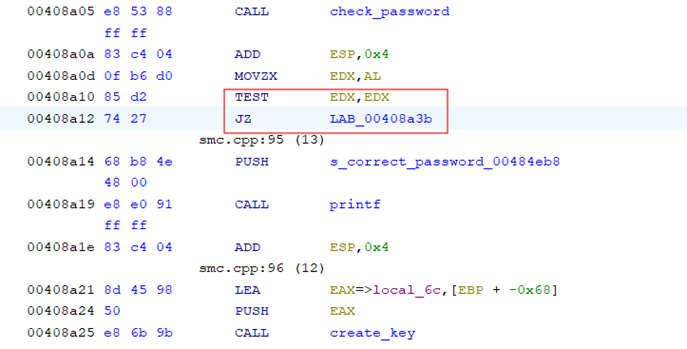<br>
          
Бинарный патчинг был проведен путем замены инструкции условного перехода JZ на два NOP. Таким образом, программа никогда не заходит в ветку wrong_password:

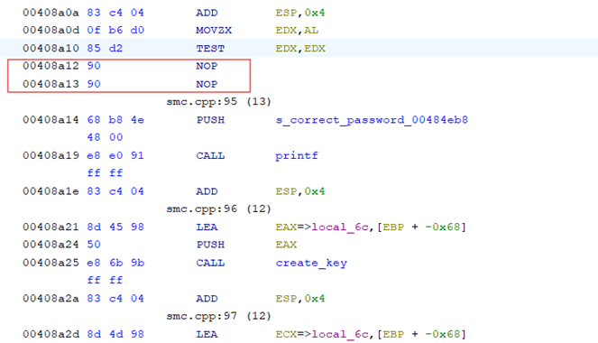<br>

После бинарного патчинга проверка пароля всегда дает положительный результат:

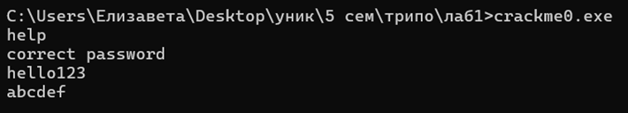<br>


## Защита ПО от возможности изменения поведения программы при помощи бинарного патчинга

### Хранение в зашифрованном виде всех строк

Все строки, используемые в программе, были зашифрованы с помощью шифра Виженера. В качестве ключа была взята строка "TRiPO_lab1". Для вывода строки каждый раз расшифровываются с помощью функции decrypt().

```
if (check_password(string)) {
        char message[] = "8B\\C5CaaSrHFa@BD";
        decrypt(message, strlen(message));
        printf("%s\n", message);
        create_key(string);
        merge_strings(string);
    }
    else {
        char message[] = "E4]DGO_Fp&MG";
        decrypt(message, strlen(message));
        printf("%s\n", message);
    }
```

### Проверка и вывод информации в разных частях программы

Был добавлен вывод сообщений в случаях несовпадения значения CRC с эталонным, выявления отладки, использования виртуальной машины и в методах против дизассемблирования. Пример выводимых сообщений представлен на рисунке:

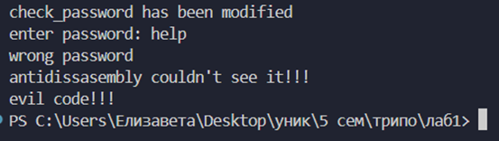<br>

### Контроль целостности участков кода, ответственных за проверку «пароля»

Для подсчета CRC участка кода, отвечающего за проверку пароля, была добавлена пустая функция check_password_end(), по которой можно судить о примерном адресе окончания функции check_password(). Также использована директива pragma auto_inline для того, чтобы компилятор не встраивал функции при вызове.

```
#pragma auto_inline(off)

bool check_password(_char_ *_string_)
{
    …
}

void check_password_end()
{
 //примерный адрес окончания check_password
}

#pragma auto_inline(on)
```

При вызове в main от этих функций берутся указатели и вычисляется CRC. При запуске в первый раз вычисляется эталонное значение EXPECTED_CRC, которое затем определяется в define. При следующих запусках вычисляемое значение сравнивается с ним:

```
unsigned char* func_start = (unsigned char*)check_password;
unsigned char* func_end = (unsigned char*)check_password_end;
size_t func_size = (size_t)(func_end - func_start);

uint32_t crc = crc32((const unsigned char* )func_start, func_size);
    //проверяем crc32
    if (crc != EXPECTED_CRC) {
        …
    }
```

### Несколько проверок пароля в разных местах программы

Были добавлены дополнительные вызовы check_password() в функциях создания серийного номера и слияния строк.

### Ложные проверки (в т.ч. сразу после считывания «пароля»)

После считывания пароля было добавлено сравнение со строкой, не являющейся паролем. В случае успеха вызываются те же самые функции создания серийного номера и слияния строк, но из-за дополнительных проверок уже внутри самих функций ничего не происходит:

```
if (strcmp(string, "ed|d1BPF")==0) {
        char message[] = "8B\\C5CaaSrHFa@BD";
        decrypt(message, strlen(message));
        printf("%s\n", message);
        create_key(string);
        merge_strings(string);
    }
```

### Использование методов запутывания кода для усложнения анализа кода программы

Реализовано в методах бинарной обфускации.

### Методы обнаружения отладки

Описанные далее методы были вынесены в функцию check_debugger(), возвращающую true, если любой из методов срабатывал, и false в противном случае.

1.    Функция IsDebuggerPresent
Самая простая API-функция для обнаружения отладчика. Она ищет в структуре блока операционного окружения процесса (process environment block, PEB) поле IsDebugged. Если оно равно нулю, выполнение происходит вне контекста отладчика; в противном случае отладчик подключен.

```
if (IsDebuggerPresent())return true;
```

2.    Функция CheckRemoteDebuggerPresent
Она тоже проверяет поле IsDebugged в структуре PEB, но может делать это как для себя, так и для другого локального процесса. Эта функция принимает в качестве аргумента дескриптор процесса и затем проверяет, подключен ли к этому процессу отладчик. Чтобы проверить текущую программу, нужно передать дескриптор ее процесса.

```
BOOL isDebuggerPresent = FALSE;
CheckRemoteDebuggerPresent(GetCurrentProcess(),&isDebuggerPresent);
if (isDebuggerPresent)return true;
```

3.     Trap Flag
Метод основан на использовании флага ловушки (Trap Flag, TF) в регистре флагов процессора (EFLAGS). Если отладчик присутствует, он перехватывает исключение, вызванное Trap Flag, и выполнение продолжается, оставляя isDebugged равным TRUE. Если отладчика нет, возникает исключение, которое обрабатывается блоком except, устанавливая isDebugged в FALSE:

```
BOOL isDebugged = TRUE;
    __try {
        __asm {
            pushfd
            or dword ptr[esp], 0x100 
            popfd                    
            nop                      
        }
    }
    __except (EXCEPTION_EXECUTE_HANDLER)
    {
        isDebugged = FALSE;
    }
    if (isDebugged)
    {
       return true;
    }
```

4.    ProccesDebugObjectHandle
Метод использует системный вызов NtQueryInformationProcess для проверки наличия объекта отладки (DebugObject), связанного с процессом. Если такой объект существует, это указывает на то, что процесс находится под отладкой.

```
HANDLE debugObject = NULL;
    NTSTATUS status = NtQueryInformationProcess(
        GetCurrentProcess(),
        0x1E,
        &debugObject,
        sizeof(HANDLE),
        NULL);
    if (0x00000000 == status && NULL != debugObject) {
        return true;
    }
```


### Методы противодействия дизассемблированию
Были использованы следующие методы:
1.    Использование ret для перехода
Метод заключается в модификации адреса возврата на стеке. Это затрудняет анализ, так как дизассемблер не может однозначно определить, куда передается управление:

```
__asm {
        call $ + 5
        add [esp], 5
        ret
    }
   char msg[] = "9<]D1SROE}NRM@ELQPi&TFO6OIabc2"; //antidissasembly couldn't see it!!!
    decrypt(msg, strlen(msg));
    printf("%s\n", msg);
```

В качестве примера после блока кода был вставлен вывод строки. После дизассемблирования его нет:

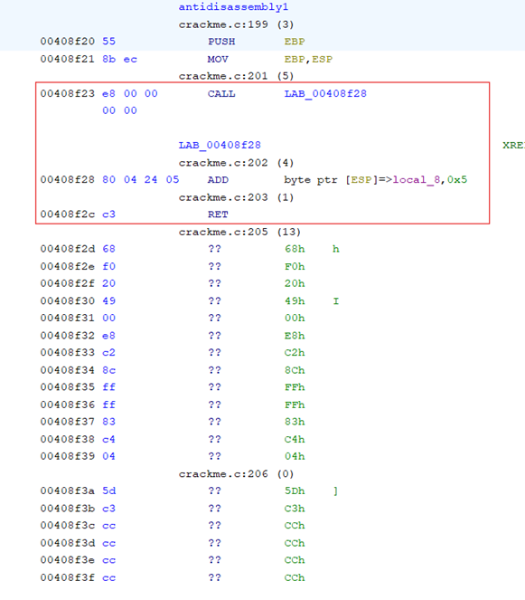<br>

2.    Перепрыгивание опкода инструкции
Метод заключается в условном переходе, который перепрыгивает вставку байта E9:

```
__asm {
        xor eax, eax
        jz label
        __emit 0xe9
    label:
        call evil_code
    }
```

При дизассемблировании этот байт интерпретируется как начало инструкции JMP, в результате чего все, что выполняется по метке label, затирается:

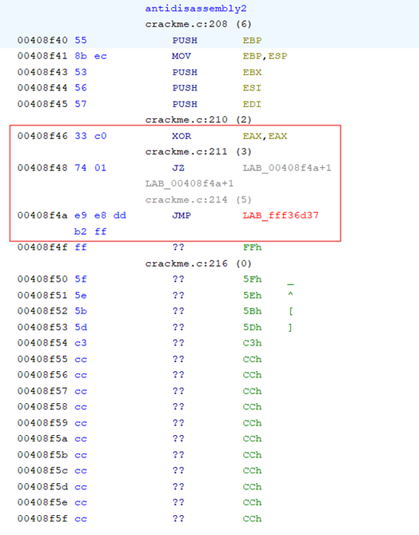<br>

3.    Impossible disassembly
Метод заключается во вставке байтов для создания некорректных, неоднозначных инструкций:

```
__asm {
        __emit 0xEB   
        __emit 0xFF   
        __emit 0xC0   
        __emit 0x48 
    }
    char msg[] = ":IS=OC\\FH2US"; //evil code!!!
    decrypt(msg, strlen(msg));
    printf("%s\n", msg);
```

Байты могут быть проинтерпретированы по-разному:
1. E8 FF – JMP -1 – прыжок на саму же метку, бесконечный цикл.
2. FF C0 – INC EAX - инкремент регистра eax, 48 – начало инструкции DEC.
В данном случае сработал первый вариант, в результате вывод строки был затерт:

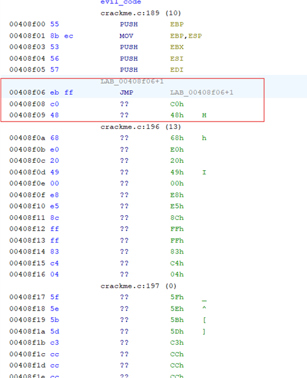<br>

### Методы обнаружения виртуальных машин

Были использованы следующие методы:

1.    Инструкция cupid
Метод использует инструкцию CPUID для проверки наличия виртуальной машины через определение бита гипервизора в регистре процессора:

```
int cpuInfo[4] = { 0 };
    __cpuid(cpuInfo, 1);
    bool isHypervisor = (cpuInfo[2] & (1 << 31));
    if (isHypervisor) return true;
```

2.    Проверка реестра
Метод проверяет значение ключа реестра Windows, связанного с информацией о системе, чтобы определить, содержит ли оно строки, указывающие на известные виртуальные машины (VirtualBox, VMware, KVM, Bochs, Xen). Это делается через доступ к ветке реестра HKEY_LOCAL_MACHINE:

```
HKEY hKey = NULL;
    LONG ret;
    char value[1024];
    DWORD size = sizeof(value);
    ret = RegOpenKeyExA(HKEY_LOCAL_MACHINE,
        "System\\CurrentControlSet\\Control\\SystemInformation",
        0,
        KEY_READ,
        &hKey);
    if (ret == ERROR_SUCCESS) {
        ret = RegQueryValueExA(hKey, "SystemProductName", NULL, NULL, (LPBYTE)value, &size);
        if (ret == ERROR_SUCCESS) { 
            if (strstr(value, "VirtualBox") || strstr(value, "VMware") || strstr(value, "KVM") || strstr(value, "Bochs") || strstr(value, "Xen")) {
                return true;
            }
        }
    }
```

### Самомодифицирующийся код
Фрагмент самомодифицирующегося кода был вставлен в main при проверке на наличие отладчика. В случае, если он обнаруживается, начало функции check_password() перезаписывается на команды xor eax, eax и ret. Таким образом, теперь эта функция всегда дает отрицательный результат, что усложняет отладку. Вставка байтов была реализована в ассемблерной вставке:

```
if (check_debugger()) {
        …
       DWORD oldProtect;
   VirtualProtect(code, 16, PAGE_EXECUTE_READWRITE, &oldProtect); //отключаем защиту от записи
        __asm {
            mov edi, offset check_password  
            mov byte ptr [edi], 0x31        
            mov byte ptr [edi + 1], 0xC0    
            mov byte ptr [edi + 2], 0xC3    
        }
        VirtualProtect(code, 16, oldProtect, &oldProtect);
        return 1;
    }

```

### Методы бинарной обфускации и обфускации потока передачи управления
Для обфускация потока передачи управления в функции merge_string() был добавлен оператор switch-case.

```
while (i < N) {
        switch (state) {
            case 0:
                …
                state = 1;
                break;
            case 1:
                …
                state = (l == -1) ? 2 : 3;
                break;
            case 2: 
                …
                state = 4;
                break;
            case 3:
                …
                state = 4;
                break;
            case 4:
                …
                state = 0;
                break;
        }
    }
```

Так же была добавлена функция compute, которая по факту просто прибавляет единицу к аргументу. При этом она выполняет «сложные» вычисления, которые не оптимизируются компилятором. Независимо от входного числа, ветки дают одинаковый результат.

```
int compute(int input) {
     if (input % 2 == 0) {
        int temp = (input >> 1) << 1; 
        return temp | 0x1;
    } else {
        double temp = sqrt(mypow(input, 2));
        return (int)temp + (2 - 1);
    }
}
```

Вызов этой функции происходит в main:

```
if (compute(3) == 4) {
        antidisassembly1();
        antidisassembly2();
    }
    else {
        doThis();
    }
```

doThis() – мусорная и недостижимая функция, в которой также выполняются вычисления:

```
void doThis() 
{
    int a,b,c,d;
    srand(time(0));
    a=rand()+1;b=rand()+1;
    c=rand()+1;d=rand()+1;
    if (a+b+c*d > 0)
    {
        printf("yes\n");
        return;
    }
    printf("no\n");
}
```

## Бинарный патчинг реализованных методов защиты

### Проверка пароля

Так как теперь проверка пароля происходит в нескольких местах, нужно было изменить само значение, возвращаемое функцией. Для этого инструкция JNZ была заменена на 2 NOP-а:

check_password() до патчинга:

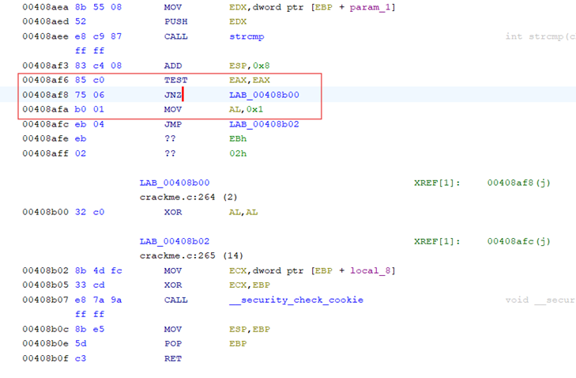<br>

check_password() после патчинга:

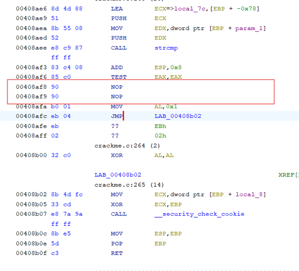<br>

### CRC
Сравнение CRC с эталонным значением выглядит следующим образом:

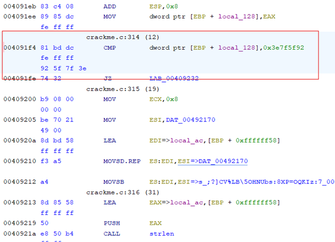<br>

После сравнения следует условный JZ. Он был заменен на инструкцию JMP, чтобы, независимо от значения CRC, программа продолжала работу:

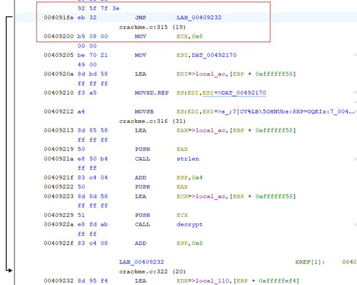<br>


В функциях check_debugger() и check_vm() используется регистр AL, в который в случае срабатывания метода обнаружения записывается 0x1. Таким образом, для патчинга инструкция MOV AL, 0x1 была заменена на MOV AL, 0x0:

check_debugger() до патчинга:

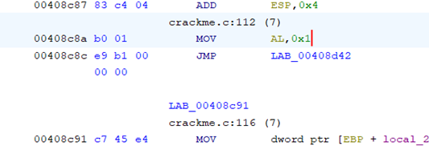<br>

check_debugger() после патчинга:

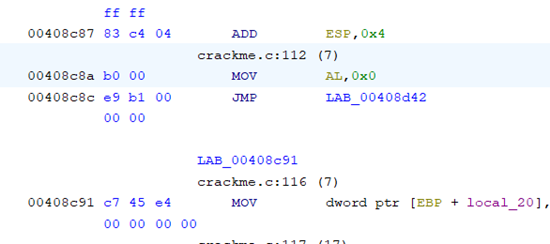<br>

## Упаковка исполняемого файла

Упаковка исполняемого файла состоит в сжатии исполнимого файла и прикреплении к нему кода, необходимого для распаковывания и исполнения содержимого файла. Для упаковки файла crackme.exe был использован упаковщик UPX. В результате размер исполняемого файла был уменьшен почти в 6 раз.

Исполняемый файл до упаковки:

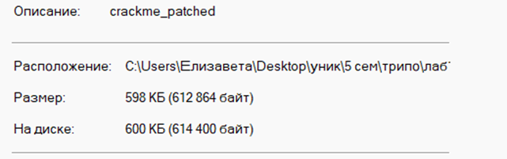<br>

Исполняемый файл после упаковки:

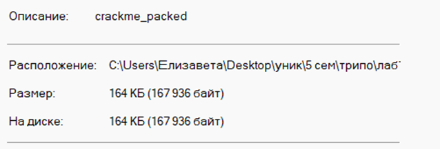<br>

Структура упакованного файла сильно сложнее исходного. Вид программы до упаковки:

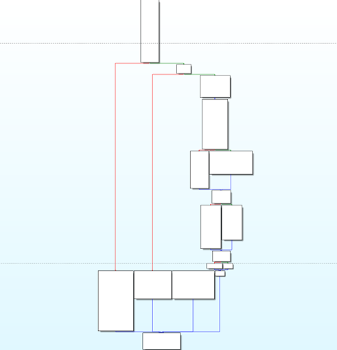<br>

Вид программы после упаковки:

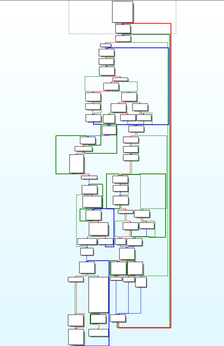<br>
          
Также у исполняемого файла изменилась точка входа. Теперь при запуске сначала запускается алгоритм распаковки, расшифрованные данные сохраняются в регистре EDI и только потом выполняется сама программа.

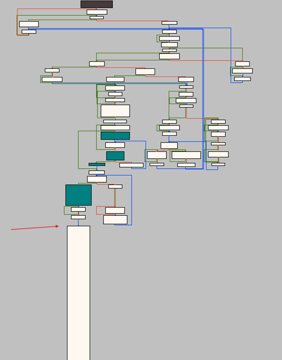<br>

В отладчике видно, что при запуске программы в самом начале распаковки используются регистры ESI и EDI:

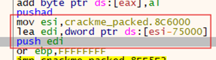<br>

В ESI хранятся запакованные данные:

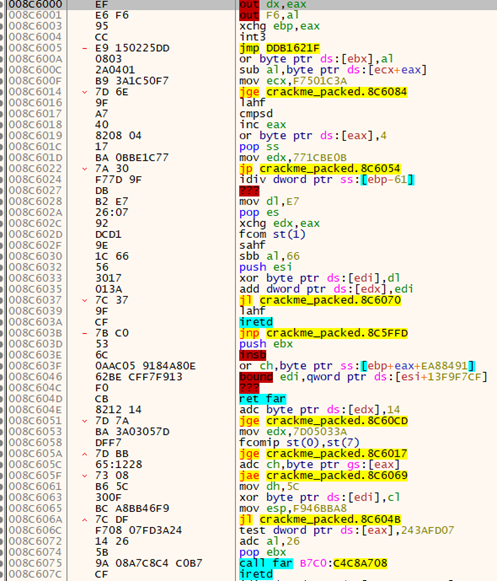<br>

После распаковки значения по регистру EDI выглядят следующим образом:

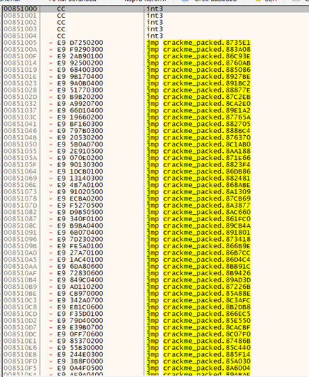<br>
          
 При этом после распаковки происходит переход на оригинальную точку входа программы:

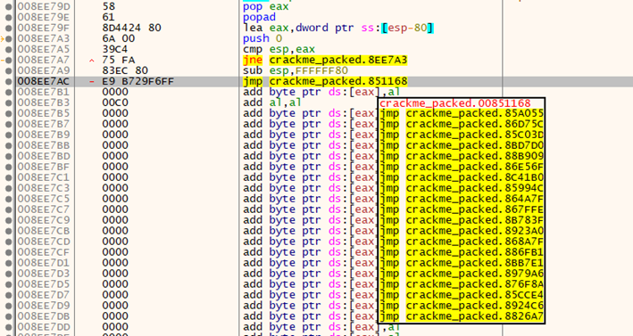<br>

Энтропия файлов означает степень случайности данных в файле и позволяет определить, содержит ли файл скрытые данные или подозрительные сценарии. Высокие значения энтропии могут говорить о том, что данные сохранены в зашифрованном и сжатом состоянии. Это подтверждается получившимися результатами.

Энтропия до упаковки файла:

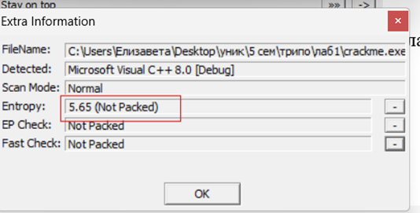<br>

Энтропия после упаковки файла:

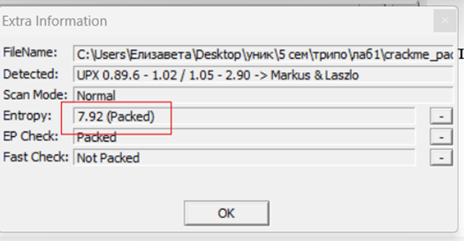<br>
